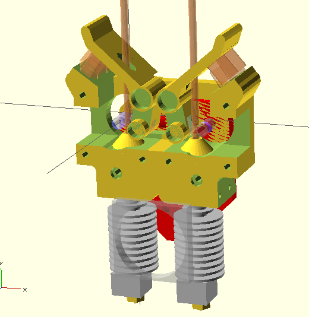

# Dual Extruder - Extrusor Dual #

Author: [Diego Viejo](www.dccia.ua.es/~dviejo)

Designed using [OpenScad](http://www.openscad.org)

## Main Features - Características Principales

* Dual Extrusion through two hotends - Extrusión Dual usando dos hotends

* Direct Extrusion - Extrusión directa

* Compact size - Tamaño compacto

* Flexible material support - Soporte para materiales flexibles

* Suitable for the most popular hotends: JHead, e3D, Prusanozzle, Leonnozle. - Compatible con los hotend más populares: JHead, e3D, Prusanozzle, Leonnozle.

* Parametrizable

## Description - Descripción

Extrusor Dual. Permite imprimir con dos hotends o cabezales. Esto posibilita la impresión en dos colores o dos materiales diferentes. Para mantener un tamaño compacto, la extrusión se realiza directamente acoplando una polea dentada en el eje de cada motor. Se recomienda el uso de poleas de 8mm de diámetro. Al no haber, por lo tanto, reducción en el movimiento del motor, éste ha de efectuar mucha más carga de trabajo. Así se recomienda el uso de controladores de motor capaces de manejar intensidades de más de 1A. La polea suelta utiliza tres rodamientos 623zz y muelles de 10mm de diámetro (Yo estoy usando [estos](http://reprapworld.com/?products_details&products_id/228/cPath/1595_1666) ).

Dual extruder. This piece allows printing using two hotends or printing heads. This feature makes possible printing using two different colors or materials. In order to maintain a compact size, a direct extrusion scheme is used by using a geared pulley directly attached to the motor axle. (8mm rad pulleys are recomended). The use of stepper drivers that can handle more than 1A it is recomended. Idler pulley uses three 623zz bearings and 10mm. diameter springs (like [these](Yo estoy usando [estos](http://reprapworld.com/?products_details&products_id/228/cPath/1595_1666) ).

## Versions

### V1.0 (Last update: Jan 31, 2015)

Printing time: about 90 minutes at 65mm/min 3mm filament.

Status: **functional**, tested for JHead and e3D (also Prusanozzle in earlier versions).

Moved to V1.0 folder

![V1.0]

Issues: 
  * It is difficult to maintain both hotends leveled due to sliding between extruder and XCarriage
  * Flexible material support is not working.
  
### V2.0 (Last update: March 16, 2015)

Printing time: about 150 minutes at 65mm/min 3mm filament.

Status: **Beta**. Under development and testing. More than 100 hours printing. 

V2.0 design fits e3D v6 3mm direct extruder or JHead by changhing a set of parameters. 

> Budas extruder is too big to be fitted in this extruder so I decided do not develop the mounting for this extruder.

Changes respect to V1.0

* Extruder has been divided in two parts. Hotend mountings have been moved to the XCarriage in order to maintain them as leveled as posible.

* Overall size is smaller.

