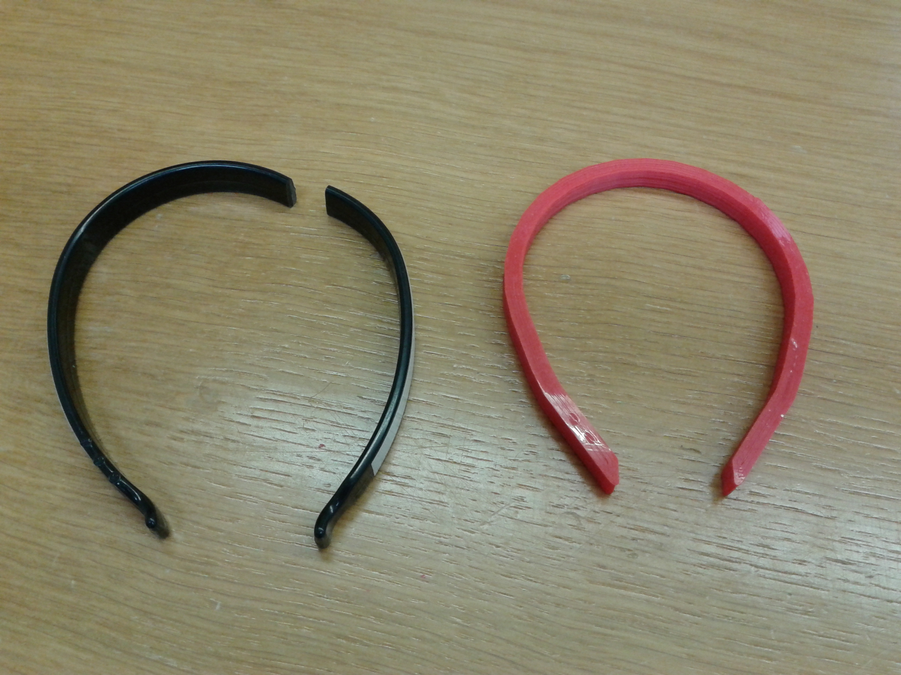

# Trousers Guard - Salva Pantalón #

Author: [Diego Viejo](www.dccia.ua.es/~dviejo)

Printing time: < 20 minutes

## Description - Descripción

Si eres de los que utilizan la bicicleta como medio de transporte habitual seguro que utilizas algún objeto que te permita poner a salvo tus pantalones del contacto con la cadena de la bicicleta. Estos elementos no son caros aunque, según mi experiencia, se rompen con facilidad. Harto ya de gastar el dinero en frágiles productos me decidí a diseñar e imprimir mis propios _salva-pantalones_.
